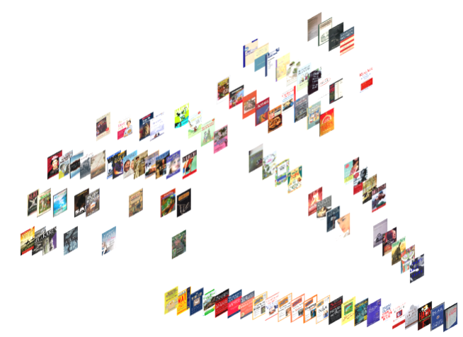
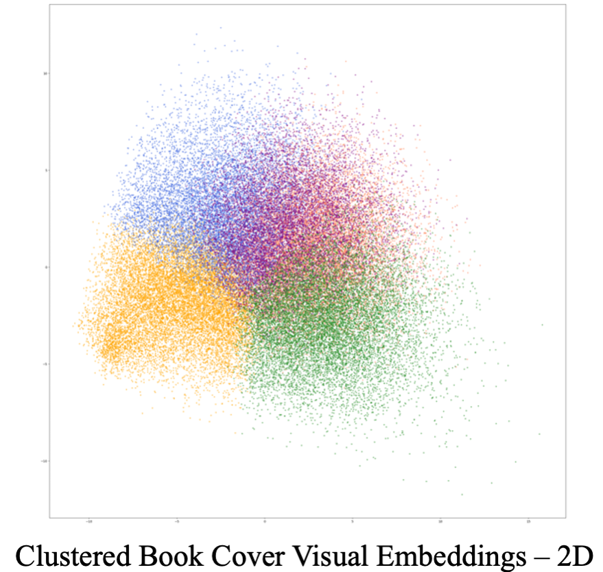

# AI Librarian: Judge A Book by Its Cover

  
   
  
  
  

:email: 
**Message for readers: Now you can browse the newly sorted shelves by visual features.**  
I am a librarian of the District of Columbia Public Library system. After observing the way people interact with the library’s collection, I became interested in how they select books through the incidental act of browsing. Despite each person having their own perspective, they exhibit common methods of browsing through a physical examination of the book’s cover. While the popular idiom is “Don’t judge a book by its cover”, readers, writers, publishers, and designers all seem to disagree. Every reader knows the excitement of seeing a book cover that unexpectedly attracts their attention. They may not be able to fully articulate why–it may be the cover’s resemblance to something they already like, a design that appeals to their aesthetic sensibilities–but the effect is undeniable.

Information systems such as the library catalog (and the commonly used, unwieldy Dewey Decimal System) are often unsuited to people’s natural browsing habits.  Using my experience as a librarian and bookseller, I decided to explore the connection between browsing habits and the physical similarities of book covers, a project with the aim of allowing people to more easily manage their browsing by collating book covers based on physical similarity. 

## Explore the latent visual similarity in book covers that leads to preference
The connection between visual preference and cover features is complicated. It might be too naive to assume that the readers will be attracted to a certain combination of color, font types. In fact, the visual attraction is not just about layout, but also the content and style that conveys the characterastic of the author, whether it is classic or [trendy](https://www.designhill.com/design-blog/top-book-cover-design-trends/).

Thus, it is better to stay open-minded and explore the most fundamental visual features instead of hand-craft a pool of rules. After careful study, I decided to borrow the intelligence from the current largest visual dataset [*ImageNet*](https://www.image-net.org/update-mar-11-2021.php). *ImageNet* has 14,197,122 images, a diverse source for visual description of all kinds. I build a simple model of neural networks from the [*PyTorch*](https://pytorch.org/), in which they provide a feature model already trained with *ImageNet*.

The book cover dataset I used contains 57,000 different samples, it is proposed by an earlier [research paper](https://arxiv.org/pdf/1610.09204.pdf) on book cover visual features and categories. Differently, I am more interested in finding the natural visual similarities despite of categories, that lead to the reader's preference. I clustered the visual features with the simplest K-Means from [scikit-learn](https://scikit-learn.org/stable/) library. The results based on a 5 cluster centers are like the following:

  
   

You can change the number of clusters, dimensions of visualization in `main.py` by changing `num_cls` and `pca=PCA(k)`.
The inital 2D and 3D visualizations of all the book covers are like the follows, you can scatter the images of book covers by calling the function `imscatter`.

  
   

## Next step
I am trying to enlarge the [dataset](https://arxiv.org/pdf/1610.09204.pdf) by adding more up-to-date book covers using a web crawler.
It will be interesting to see more refined clusters and their relations to year.

Many thanks to my friends from the technology [Kamal](https://kampta.github.io/) and [Luyu](http://www.loyo.me/) that helped me finding the resources.

